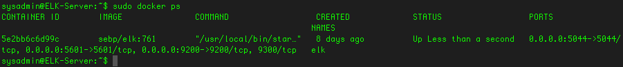

## Automated ELK Stack Deployment

The files in this repository were used to configure the network depicted below.

These files have been tested and used to generate a live ELK deployment on Azure. They can be used to either recreate the entire deployment pictured above. Alternatively, select files of the ansible/roles/ directory may be used to install only certain pieces of it, such as Filebeat.

  - dvwa.yml: Install / start dvwa Docker container
  - elk.yml: Install / start elk Docker container
  - filebeat-playbook.yml: Install Filebeat / start Docker container
  - metricbeat-playbook.yml: Install / start Docker container

This document contains the following details:
- Description of the Topologu
- Access Policies
- ELK Configuration
  - Beats in Use
  - Machines Being Monitored
- How to Use the Ansible Build

### Description of the Topology

The main purpose of this network is to expose a load-balanced and monitored instance of DVWA, the D*mn Vulnerable Web Application.

Load balancing ensures that the application will be highly available, in addition to restricting inbound access to the network.

Integrating an ELK server allows users to easily monitor the vulnerable VMs for changes to the file system and system metrics.

The configuration details of each machine may be found below.

| Name                 | Function          | IP Address | Operating System |
|----------------------|-------------------|------------|------------------|
| Jump-Box-Provisioner | Gateway           | 10.0.0.8   | Ubuntu 18.04 LTS |
| Web1                 | Web Server        | 10.0.0.11  | Ubuntu 18.04 LTS |
| Web2                 | Web Server        | 10.0.0.9   | Ubuntu 18.04 LTS |
| Web3                 | Web Server        | 10.0.0.12  | Ubuntu 18.04 LTS |
| ELK-Server           | Monitoring Server | 10.1.0.4   | Ubuntu 18.04 LTS |

### Access Policies

The machines on the internal network are not exposed to the public Internet. 

Only the Jump-Box-Provisioner machine can accept connections from the Internet. Access to this machine is only allowed from the following IP address '73.162.194.240'

Machines within the network can only be accessed by each other.

A summary of the access policies in place can be found in the table below.

| Name                 | Publicly Accessible | Allowed IP Addresses     |
|----------------------|---------------------|--------------------------|
| Jump-Box-Provisioner | Yes                 | 73.162.194.240           |
| Web1                 | No                  | 10.0.0.8                 |
| Web2                 | No                  | 10.0.0.8                 |
| Web3                 | No                  | 10.0.0.8                 |
| ELK-Server           | No                  | 10.0.0.8, 73.162.194.240 |

### Elk Configuration

Ansible was used to automate configuration of the ELK machine. No configuration was performed manually, which is advantageous because automation through an ansible playbook allows for identical elk servers to be easily configured if needed.

The playbook implements the following tasks:
- Install Docker
- Increase Virtual Memory
- Download and launch a Docker elk container

The following screenshot displays the result of running `docker ps` after successfully configuring the ELK instance.

### Target Machines & Beats
This ELK server is configured to monitor the following machines:
- Web1: 10.0.0.9
- Web2: 10.0.0.11
- Web3: 10.0.0.12

We have installed the following Beats on these machines:
- Filebeat
- Metricbeat

These Beats allow us to collect the following information from each machine:
- Filebeat allows us to retrieve and analyze the Apache server and MySQL logs from the DVWA servers.
- Metricbeat collects the system metrics from all DVWA servers to help monitor server performance and troubleshoot any possible issues.

### Using the Playbook
In order to use the playbook, you will need to have an Ansible control node already configured. Assuming you have such a control node provisioned: 

SSH into the control node and follow the steps below:
- Copy the dvwa.yml, elk.yml, filebeat-playbook.yml, and metricbeat-playbook.yml files to /etc/ansible.
- Update the hosts file to include the IP addresses of the target machines (ie. 10.0.0.11 ansible_python_interpreter=/usr/bin/python3). You can create a group such as '[webservers]' to configure the DVWA servers and '[elk]' to configure the ELK server.
- Run the playbook, and navigate to http://13.82.208.63:5601/app/kibana to check that the installation worked as expected.

## Commands to Download and run Playbook
- mkdir files
- git clone https://github.com/spencer-enriquez/Security-Fundamentals.git
- cp files/* /etc/anisble/
- cd /etc/ansible/
- nano hosts
  Example:
    [webservers]
    10.0.0.11 ansible_python_interpreter=/usr/bin/python3
    10.0.0.9 ansible_python_interpreter=/usr/bin/python3
    10.0.0.12 ansible_python_interpreter=/usr/bin/python3
- ansible-playbook roles/dvwa.yml
- ansible-playbook roles/elk.yml
- ansible-playbook roles/filebeat-playbook.yml
- ansible-playbook roles/metricbeat-playbook.yml
